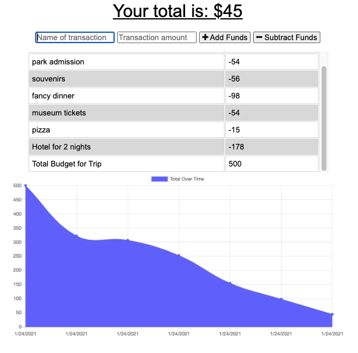

# Budget Tracker Starter

 
 [View Live App Here](https://floating-fortress-49753.herokuapp.com/)
 
 [Github](https://github.com/cgsdesign/budget-tracker)

## Description 

For this project I worked with IndexedDB, Service-Worker, Manifest, MongoDB Atlas and Heroku to make the existing BudgetTracker code into a live PWA with offline capabilities hosted on Heroku.

## Key Features
* Offline ability to add transactions via IndexedDB
* Upon reconnection to internet, stored transactions automatically sent to DB
* User notification when transactions are added to DB

## Installation
Download files from [this github repo](https://github.com/cgsdesign/E-CommerceBackEnd). Instal express, mongoose, morgan, & compression npms. 
* Note: this app is intended for Google Crome Use Only.

## License
* MIT

## <a name="badge">Badges</a>

## <a name="contributing">Contributing Information</a>
* [Contributor Covenant](https://www.contributor-covenant.org/)

## <a name="questions">Questions</a>
### contact me at: 
* github: [https://github.com/cgsdesign](https://github.com/cgsdesign)
* email: [cgsdesignmadison@gmail.com](cgsdesignmadison@gmail.com)
